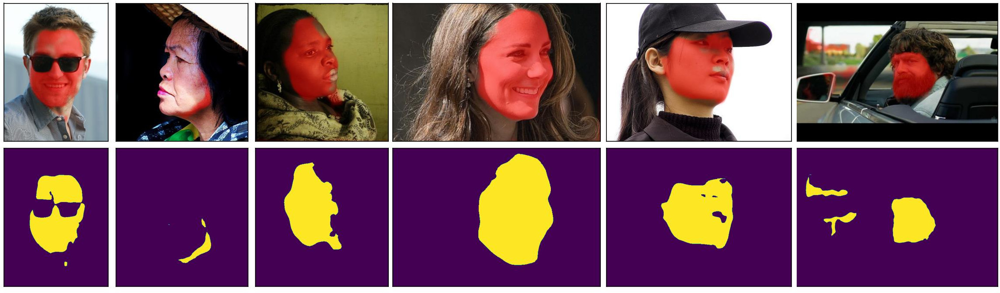
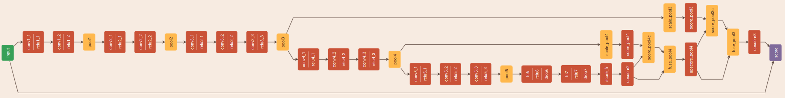

# face_segmentation_pytorch


PyTorch implementation of the [YuvalNirkin/face_segmentation](https://github.com/YuvalNirkin/face_segmentation) model featured in the paper:

```
@inproceedings{nirkin2018_faceswap,
      title={On Face Segmentation, Face Swapping, and Face Perception},
      booktitle = {IEEE Conference on Automatic Face and Gesture Recognition},
      author={Nirkin, Yuval and Masi, Iacopo and Tran, Anh Tuan and Hassner, Tal and Medioni, and G\'{e}rard Medioni},
      year={2018},
    }
```

This repository includes the PyTorch version of their pre-trained model, and is mainly intended to facilitate mask renderings like the following (images from the [iBugMask dataset](https://ibug.doc.ic.ac.uk/resources/ibugmask/), downloaded [here](https://github.com/hhj1897/face_parsing#ibugmask-dataset)):




Direct advantages:
* More flexible inference, including different image shapes (although they are recommended to be in the ballpark of `500x500`, see [source](https://github.com/YuvalNirkin/face_segmentation/blob/6d9fc81a32e396bcafae6ba61318a23427f6aa98/interfaces/python/face_seg.py#L9)) and the possibility of getting heatmaps instead of masks.
* **Zero** dependency on Caffe. Pure and plain PyTorch

While the main intent for this repository is inference, flexible support for CPU and CUDA is given, and with minimal extensions can be used for training and finetuning (PRs are welcome).

Here is a visualization of the architecture using the [Netscope](https://ethereon.github.io/netscope/quickstart.html) `.prototxt` visualizer:



And [here](face_segmentation_pytorch/model.py) the corresponding PyTorch implementation.
The model parameters have been converted to a PyTorch statedict and released [here](https://github.com/andres-fr/face_segmentation_pytorch/releases).


-----------------------------------------------

# Installation

This package can be locally installed via PIP as follows (tested on Ubuntu 20.04):

```
pip install git+https://github.com/andres-fr/face_segmentation_pytorch.git
```

Alternatively, the following steps install the dependencies from scratch, using conda with python 3.9 and **PyTorch CPU-only** (much faster and smaller installation, but no GPU acceleration):

```
conda create -n facemask python==3.9
conda activate facemask
conda install pytorch torchvision torchaudio cpuonly -c pytorch
conda install -c conda-forge omegaconf
conda install -c anaconda pillow
conda install -c conda-forge python-wget
conda install -c anaconda protobuf
# Install package but ignore the provided dependencies
pip install --no-deps git+https://github.com/andres-fr/face_segmentation_pytorch.git
```

Exhaustive examples of functioning dependencies can be seen in:
* [`requirements-cpu.txt`](requirements-cpu.txt)
* [`requirements-gpu.txt`](requirements-gpu.txt)


-----------------------------------------------

# Usage:

This package can be used from CLI to extract heatmaps or masks from a set of images and save them into the same directory, as follows:

```
python -m face_segmentation_pytorch MODEL_PARAMS_DIR=<WORKSPACE> IMGS_DIR=<MY_IMAGES>
```

Note that, if the model parameters are not present in the given directory, the library will attempt to download them from [here](https://github.com/andres-fr/face_segmentation_pytorch/releases), so you just need to provide a directory that is convenient, and then reuse it to prevent further downloads.

To extract masks instead of the heatmaps, add the `MASK_THRESHOLD=0.5` (any threshold between 0 and 1 works).


### Python Examples:

The [`__main__`](face_segmentation_pytorch/__main__.py) module contains an example on how to extract heatmaps and masks from Python. A reduced example is as follows:

```python
import torch
from PIL import Image
import face_segmentation_pytorch as fsp

# create model and load pretrained parameters
model = fsp.model.FaceSegmentationNet()
fsp.utils.load_model_parameters(model, MODEL_PARAMS_DIR)
model.eval()

# load image
img = Image.open(IMAGE_PATH).convert("RGB")

# inference
with torch.no_grad():
    t = model.img_to_input(img, pre_normalize=True).unsqueeze(0)
    out = model(t, as_pmap=True)[0]
```


* To create plots like the above, the `plt_debug` function can be used (requires to install [matplotlib](https://matplotlib.org/)).


* The snippet below loads a `caffemodel` and convert into a PyTorch model and saves the corresponding `state_dict`:


```python
import torch
import face_segmentation_pytorch as fsp

# create model and load pretrained parameters
model = fsp.model.FaceSegmentationNet()
fsp.utils.load_model_parameters(model, <CAFFEMODEL_DIR>, caffemodel_name=<CAFFEMODEL_NAME>)
torch.save(model.state_dict(), OUTPATH)
```

